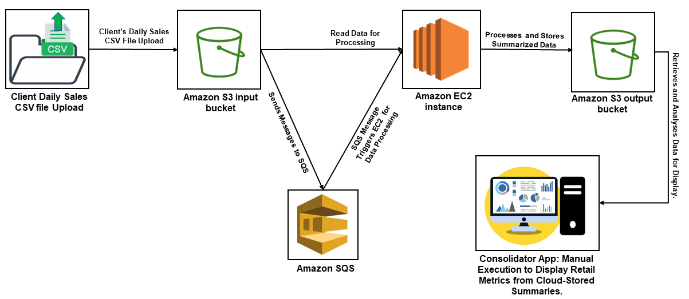
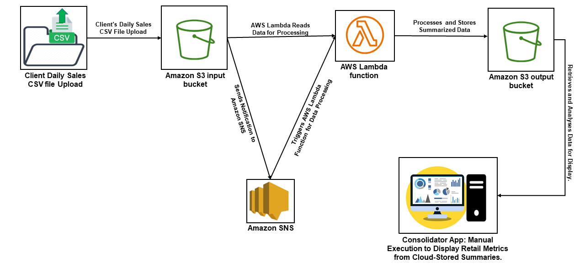

# Global Retail Data Management: Deploying Sales Application on AWS EC2 and AWS Lambda

__A global retail sales data summarization and consolidation service using AWS services__
- - - -

## Context

In the proposed AWS Cloud Sales Application project for a global retailer, we have two solution architectures for managing daily sales data. Both solutions involve three applications: Client, Worker, and Consolidator. The first solution has the Client Application uploading daily sales data in CSV format to an Amazon S3 input bucket, with Amazon SQS notifying the Worker Application. This Worker Application processes the CSV files, summarizing sales data by store(Total profit) and by product(Total quantity, Total sold, Total profit), and saves it to an S3 output bucket, ensuring robust processing under varying loads. The Consolidator Application, run manually, processes data from a specific date, aggregating key metrics like total retailer’s profit, the most and least profitable stores, and the total quantity, total sold, and total profit per product. The second solution is similar, but Client Application uses Amazon SNS for notifications and AWS Lambda for the Worker Application, enhancing scalability and fault tolerance. The Consolidator Application's role remains unchanged, providing crucial sales insights.

## Project Folder Structure

  
   
  <em></em>

## Required Tools and Services
Pre-requisite tools for the environment setup.
- Java 17
- Apache Maven 3.9.5+
- AWS SDK for Java 2.x

The solution architecture used the following AWS services:
- Amazon EC2
- AWS Lambda
- Amazon S3
- Amazon SQS
- Amazon SNS

## Solution Architecture Overview

### Solution 1: Traditional Server-Based Approach

  
   
  <em>Figure 1: Traditional Server-Based Solution Architecture Using EC2 and Amazon SQS</em>

1. Client Application:
    - *Purpose*: Manage daily sales data for each store.
    - *Functionality*: 
        - Uploads daily sales data in CSV format to Amazon S3 input bucket.
        - Notifies the Worker application via Amazon SQS.
    - *AWS Services Used*: Amazon S3 bucket, Amazon SQS.

2. Worker Application (Java on EC2):
    - *Java Application on EC2* : Triggered by SQS messages, runs on an Amazon EC2 (Elastic Compute Cloud) instance. A traditional server-based approach.

    - *Purpose*: Process and summarize sales data.
    - *Functionality*:
        - Triggered by messages from Amazon SQS.
        - Reads CSV files from the Amazon S3 input bucket.
        - Summarizes data by store and product.
            * *By Store* : Total profit.
            * *By Product* : Total quantity sold, total sales, total profit.
        - Saves summarized data in a new CSV file in an Amazon S3 output bucket.
        - Ensures robust processing, handling cases of unavailability or high load.
    - *Resilience*: Handles unavailability or high load by ensuring eventual processing of sales files.
    - *AWS Services Used*: Amazon EC2, Amazon S3 bucket, Amazon SQS.

3. Consolidator Application:
    - *Purpose*: Aggregates the summarized data. Compiles and displays comprehensive sales information.

    - *Functionality*:
        - Manually executed by an operator.(Operator will provide a date as an input)
        - Takes a date as an argument to identify which files to process.
        - Reads summary results from Amazon S3 output bucket and displays data such as total retailer profit, most/least profitable stores, and total sales/profit per product.
    - *AWS Services Used*: Amazon S3 bucket.

### Solution 2: Serverless Approach

  
   
  <em>Figure 2: Serverless Approach Solution Architecture Using AWS Lambda Function and Amazon SNS</em>

1. Client Application:
    - *Purpose*: Same as in Solution 1.
    - *Functionality*: 
        - Identical to Solution 1, but notifies Worker application via Amazon SNS.
    - *AWS Services Used*: Amazon S3 bucket, Amazon SNS.

2. Worker Application (AWS Lambda Function):
    - *AWS Lambda Function* : Automatically triggered by SNS notifications. A serverless option that automatically triggers upon notification.
    - *Purpose*: Same as in Solution 1.
    - *Functionality*:
        - Automatically triggered by SNS notifications.
        - Reads the uploaded CSV file from Amazon S3 input bucket.
        - Summarizes data by store and product.
            - *By Store* : Total profit.
            - *By Product* : Total quantity sold, total sales, total profit.
        - Saves the summarized data in a new CSV file in the  Amazon S3 output bucket.
        - Ensures robust processing, handling cases of unavailability or high load.
    - *Resilience*: Built-in scalability and fault tolerance.
    - *AWS Services Used*: AWS Lambda, Amazon S3 bucket, Amazon SNS.

3. Consolidator Application:
    - *Purpose* and *Functionality*: Identical to Solution 1.
    - *AWS Services Used*: Amazon S3 bucket.

## Justification of Proposed Solution Architecture and Chosen AWS Services

### Rationale Behind the Solution Architecture

1. Modular Design with Three Core Applications (Client, Worker, Consolidator):
   - *Justification*: This design facilitates specialized handling of distinct stages in the data processing pipeline, enhancing efficiency and manageability. Each application focuses on specific tasks, allowing for optimization and scalability tailored to those functions.

2. Global Scalability and Efficiency:
   - *Justification*: Considering the retailer's global presence, the architecture is designed to handle large volumes of data from various locations efficiently. The cloud-based approach enables scaling according to demand, ensuring that the system can manage peak loads without unnecessary overhead during quieter periods.

3. Flexibility in Approach (Traditional Server-Based vs. Serverless):
   - *Justification*: Providing two architectural solutions offers flexibility. The traditional server-based approach suits scenarios where more control over the computing environment is required, while the serverless approach is ideal for unpredictable workloads, reducing operational costs and complexity.

### Justification for Specific AWS Services

1. Amazon EC2 (for Java Application in Worker - Traditional Approach):
   - *Justification*: EC2 provides a flexible and controlled computing environment, necessary for complex or legacy applications that may not be easily adapted to a serverless architecture. It also offers the ability to customize the computing, storage, and networking configurations as per the application's specific needs.

2. AWS Lambda (for Worker Application in Serverless Approach):
   - *Justification*: Lambda is chosen for its scalability and cost-effectiveness. It allows the Worker application to automatically scale with the incoming workload and incurs costs only when the function is running, making it ideal for varying workloads.

3. Amazon S3 Bucket (for Data Storage):
   - *Justification*: S3 is used for its scalability, durability, and security in storing large volumes of data. It's an ideal choice for storing both input (daily sales CSV files) and output (summarized data), providing a centralized and secure data repository.

4. Amazon SQS (for Message Queueing in Traditional Approach):
   - *Justification*: SQS ensures reliable delivery and decoupling of the Client and Worker applications. It manages message queues, which helps in maintaining the integrity of data processing even in the event of component failures or high load.

5. Amazon SNS (for Notifications in Serverless Approach):
   - *Justification*: SNS is suitable for triggering the Lambda-based Worker application, especially in a serverless architecture. It efficiently handles message broadcasting to multiple subscribers, which is useful when scaling the application to handle high volumes of data.

### Additional Considerations in Service Selection

1. Scalability Concerns:
   - *Justification*: Both AWS Lambda and EC2 were selected with scalability in mind. Lambda offers automatic scaling, and EC2 provides the ability to manually scale as per the application's demand.

2. Cost-Effectiveness:
   - *Justification*: The serverless architecture, particularly AWS Lambda, provides a cost-effective solution for handling variable workloads due to its pay-per-use pricing model.

3. Data Security and Compliance:
   - *Justification*: Ensuring data security and compliance is a priority. AWS services like S3 offer robust security features and compliance with various data protection regulations, which is essential for handling sensitive retail sales data.

4. Monitoring and Logging with AWS CloudWatch:
   - *Justification*: CloudWatch is recommended for its comprehensive monitoring and logging capabilities. It enables real-time monitoring of AWS resources and applications, helping in quick identification and resolution of issues.

## Quantitative and Qualitative Comparison of Worker Application: AWS Lambda vs. Java on EC2

### Quantitative Comparison

1. Performance Metrics:
   - *EC2-Based Java Application*: Performance depends on the EC2 instance type chosen. Metrics like CPU utilization, memory usage, and network throughput are key indicators.
   - *AWS Lambda*: Performance is measured in terms of execution time and memory usage. AWS Lambda automatically scales, but it has execution time and memory limits per function.

2. Cost:
   - *EC2-Based Java Application*: Costs are incurred based on the instance type, storage, and network resources used, regardless of whether the application is actively processing data.
   - *AWS Lambda*: Costs are based on the number of requests and the duration of code execution. This pay-per-use model can be more cost-effective for intermittent workloads.

3. Scalability:
   - *EC2-Based Java Application*: Scalability is manual or auto-scaled within the limits of the EC2 instance types.
   - *AWS Lambda*: Automatically scales with the number of incoming requests, offering high scalability without manual intervention.

### Qualitative Comparison

1. Ease of Management:
   - *EC2-Based Java Application*: Requires more hands-on management for scaling, patching, and securing the server environment.
   - *AWS Lambda*: Requires minimal management as it abstracts away the server and operating system maintenance.

2. Development and Deployment Complexity:
   - *EC2-Based Java Application*: Potentially more complex due to the need to manage the entire application stack and deployment process.
   - *AWS Lambda*: Simplifies deployment with a focus on code alone, reducing the operational burden.

3. Flexibility and Control:
   - *EC2-Based Java Application*: Offers more control over the computing environment, which is beneficial for complex applications or specific compliance requirements.
   - *AWS Lambda*: Provides less control over the environment but offers greater flexibility in scaling and operation.

4. Resilience and Fault Tolerance:
   - *EC2-Based Java Application*: Requires explicit strategies for handling unavailability and high load.
   - *AWS Lambda*: Offers built-in fault tolerance and handles high load scenarios seamlessly.

5. Startup Time:
   - *EC2-Based Java Application*: Longer startup times due to the need to boot up an EC2 instance.
   - *AWS Lambda*: Typically has faster startup times, especially relevant for short and intermittent tasks.

6. Integration with AWS Services:
   - Both the EC2-based Java application and AWS Lambda offer robust integration with other AWS services like S3, SQS, and SNS. However, Lambda might have an edge in serverless architectures due to its native integration and automatic triggering capabilities.

### Conclusion

- Solution 1 is less efficient in terms of cloud resource usage due to the continuous operation of EC2 instances.Continuous operation of EC2 instances might not be ideal for companies looking to minimize their cloud footprint or manage costs tightly.
- Solution 2 is more efficient, especially with its use of AWS Lambda, reducing the need for continuously running resources. The serverless architecture aligns well with companies aiming for cost-effectiveness, scalability, and reduced operational overhead.

Based on the requirement to use the least amount of cloud services, <strong>Solution 2</strong> is a better fit. However, further optimizations, particularly around the use of EC2 for the Client and Consolidator applications, could enhance its efficiency.

## Development Steps:

### Solution 1: Traditional Server-Based Approach (Worker Application (Java on EC2))

- Create an EC2 instance on AWS cloud for hosting the Worker Java application, we followed the provided steps in this [link](https://ci.mines-stetienne.fr/cps2/course/cloud/labs/01-aws-ec2.html).

- Create two Amazon S3 buckets: one, introduced as "sales-data-input-bucket," for the Client Application to upload daily sales data, and another, known as "sales-data-output-bucket," for the Worker Application to store processed and summarized data, by following the steps provided in this [link](https://ci.mines-stetienne.fr/cps2/course/cloud/labs/02-aws-s3.html).

- Create an Amazon SQS queue to facilitate communication between the Client Application and the Worker Application on EC2 by following the steps in this [link](https://ci.mines-stetienne.fr/cps2/course/cloud/labs/05-aws-sqs-sns.html).

- Build the Maven .jar file for the worker java application using IDEs such as VSCode or IntelliJ IDEA, ensuring the file is named with the suffix “*-jar-with-dependencies.jar” (e.g., worker-java-application-1.0-SNAPSHOT-jar-with-dependencies.jar).

- Connect to the EC2 instance using PuTTY by following the provied steps in this [link](https://docs.aws.amazon.com/AWSEC2/latest/UserGuide/putty.html#putty-ssh). 

- Upload the built .jar file, worker-java-application-1.0-SNAPSHOT-jar-with-dependencies.jar, to the EC2 instance using SFTP client like fileZilla by following the provied steps in this [link](https://ci.mines-stetienne.fr/cps2/course/cloud/labs/01-aws-ec2.html).

- Run the worker java application on EC2 instance using PuTTY. 

### Solution 2: Serverless Approach (Worker Application (AWS Lambda Function))

- Create two Amazon S3 buckets: already created in solution one. 
- Create Amazon SNS for the Client Application to notify the worker Lambda function, as described in this [link](https://ci.mines-stetienne.fr/cps2/course/cloud/labs/05-aws-sqs-sns.html).
- Create a Lambda function on AWS Console and add the created SNS trigger using the steps provided in this [link](https://ci.mines-stetienne.fr/cps2/course/cloud/labs/04-aws-lambda.html).

- Build the Maven .jar file for the Worker lambda function using IDEs such as VSCode or IntelliJ IDEA, ensuring the file is named  worker-lambda-application-1.0-SNAPSHOT.jar. 

- Upload this .jar(worker-lambda-application-1.0-SNAPSHOT.jar) file in the AWS lambda function using the steps provided in this [link](https://ci.mines-stetienne.fr/cps2/course/cloud/labs/04-aws-lambda.html).

## Run The Project

### Solution 1: Traditional Server-Based Approach (Worker Application (Java on EC2))

- Run the Client Application on the local machine using IntelliJ or VSCode. The application will upload sales data to the AWS S3 input bucket *sales-data-input-bucket* and notify a worker application via SQS.
- Check the files uploaded in AWS S3 input bucket named *sales-data-input-bucket*.
- Run the Worker Application on the EC2 instance using the command: `java -jar worker-java-application-1.0-SNAPSHOT-jar-with-dependencies.jar`. The application connects to AWS S3 and SQS, monitors the SQS queue for new messages, processes files from *sales-data-input-bucket* and writes results to a new CSV file. Upload the processed data to the *sales-data-output-bucket* and clean up the original files from the S3 input bucket *sales-data-input-bucket* and SQS messages.
- Check the files uploaded in AWS S3 output bucket named *sales-data-output-bucket*.
- Run the Consolidator Application on the local machine using IntelliJ or VSCode. The application will retrieve and process data from the AWS S3 bucket *sales-data-output-bucket* based on the specified date input.

### Solution 2: Serverless Approach (Worker Application (AWS Lambda Function))

- Run the Client Application on the local machine using IntelliJ or VSCode.This application automatically uploads sales data files to the AWS S3 bucket *sales-data-input-bucket* and notifies worker Lambda function via Amazon SNS.
- Check the files uploaded in AWS S3 input bucket named *sales-data-input-bucket*.
- Check the monitor logs on AWS Lambda function console. When AWS Lambda function triggered by SNS notifications. The WorkerLambda function processes the sales data: it reads S3 bucket names and file names from SNS messages, downloads files from S3, processes the sales data, and calculates profits and product summaries. Write the results to a CSV file and upload it to the *sales-data-output-bucket* on S3. Post-processing, it removes the original file from AWS S3 bucket *sales-data-input-bucket*.
- Check the files uploaded in AWS S3 output bucket named *sales-data-output-bucket*.
- Run the Consolidator Application on the local machine using IntelliJ or VSCode. The application will retrieve and process data from the AWS S3 bucket *sales-data-output-bucket* based on the specified date input.
